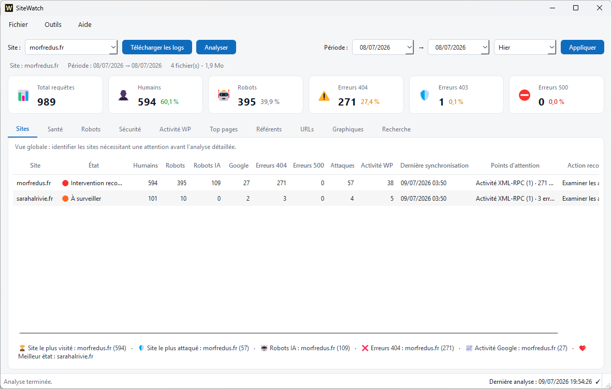
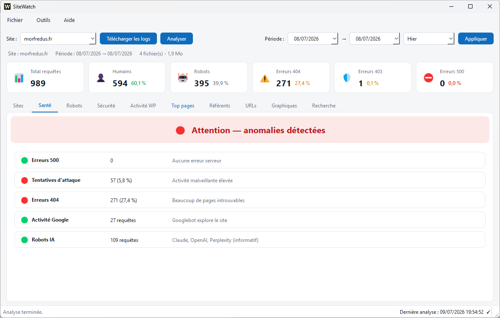
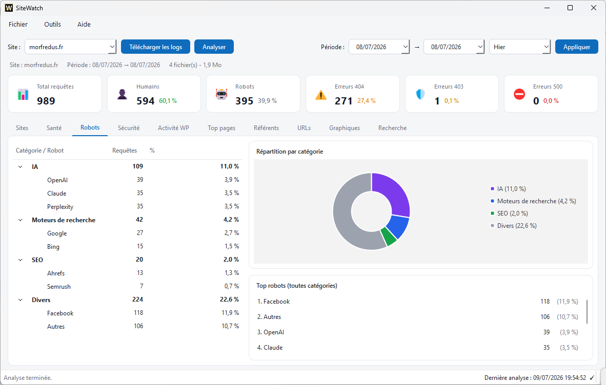
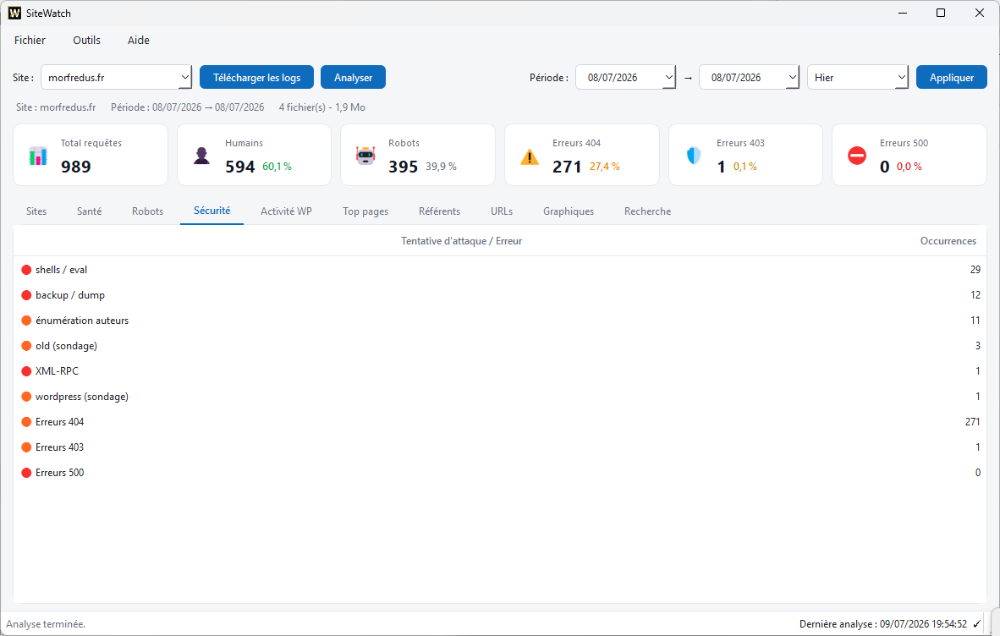
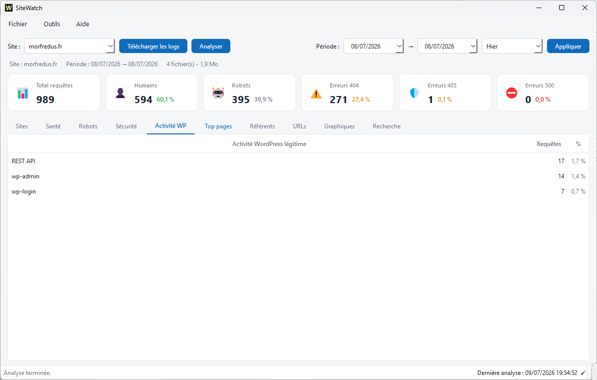
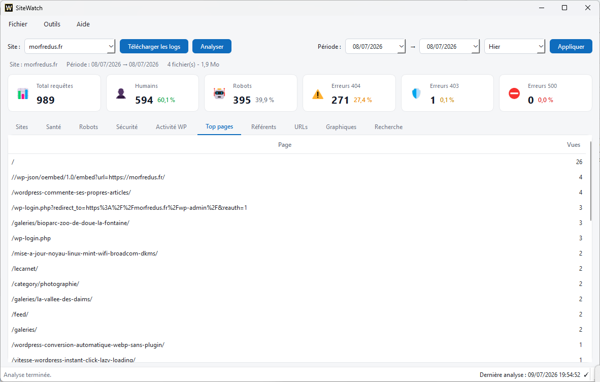
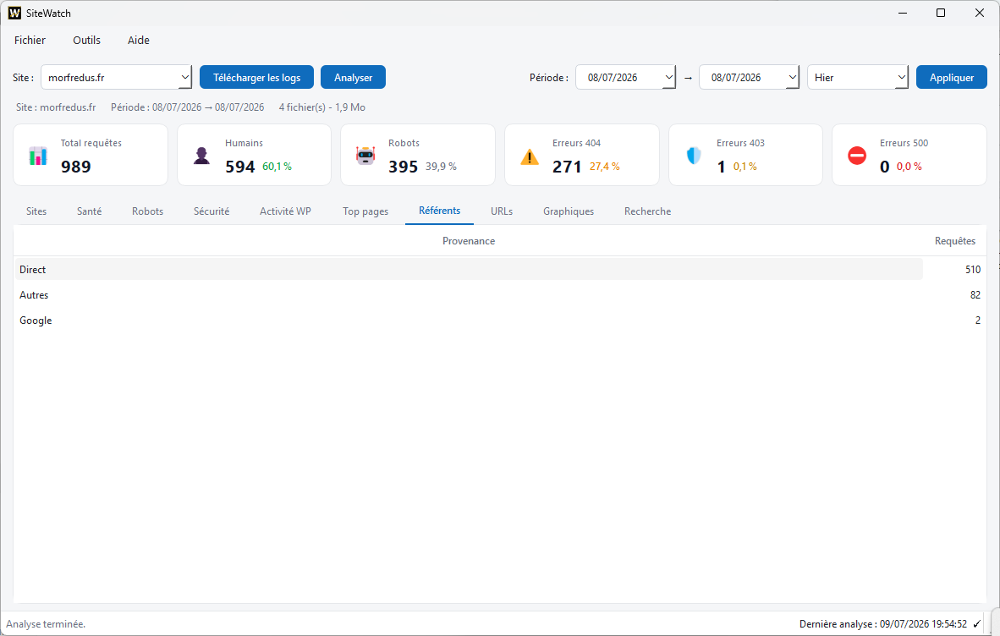
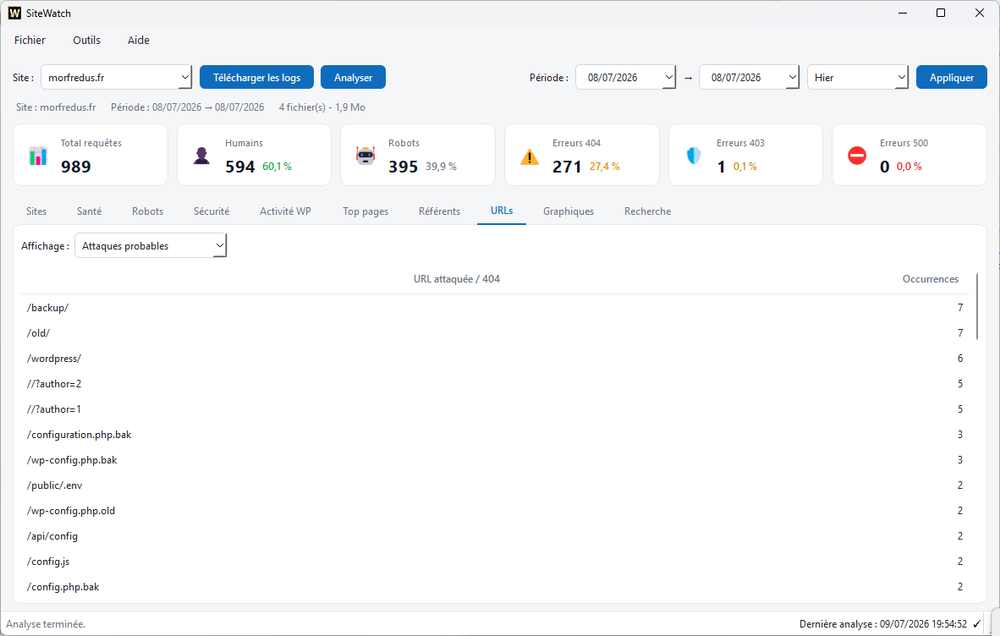
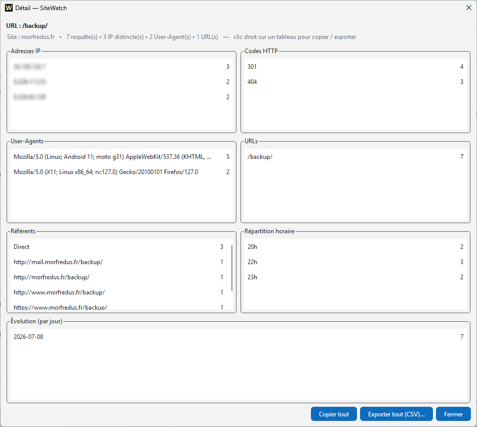
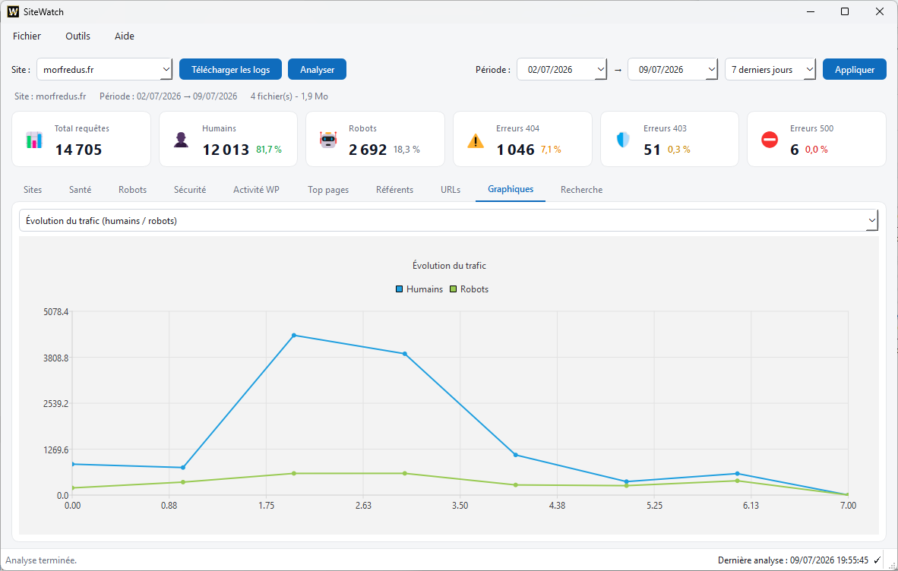

# SiteWatch

[](CHANGELOG.md)
[](LICENSE)


**🌍 Language:** English · [Français](README.fr.md)

> ✅ **Build and runtime verified** on **Windows 11** (MSYS2/MinGW, Qt 6.11),
> **Linux Mint 22.3 “Zena”** (Ubuntu 24.04 LTS base, Qt 6.4) and **Raspberry Pi 4**
> (Raspberry Pi OS 64-bit).

**Cross-platform desktop investigation tool for Apache and LiteSpeed access logs.**

SiteWatch is a **cross-platform Qt / C++17 application** for website
administration and monitoring. It runs natively on **Windows, Linux (x86_64 and
ARM64) and Raspberry Pi** — Windows is one supported platform among others, not
the only target.

Unlike traditional analytics tools, it does not aim to count visitors or produce
marketing reports. Its goal is much simpler:

> **Understand what really happened on a web server.**

It downloads Apache or LiteSpeed access logs over SFTP, analyzes them locally and
presents the results in an immediately actionable form — **no SQL database, no
WordPress dependency, no plugin to install on the monitored sites**. It reads the
compressed log files (`.gz`) directly.

SiteWatch works with any host offering SSH/SFTP access, and ships with an
advanced integration for **o2switch** (automatic firewall opening via the cPanel
API).

Because it is not tied to Windows, SiteWatch fits low-power, always-on setups:

- a **Raspberry Pi** continuously watching several sites;
- a **Linux VM** running SiteWatch as a scheduled task;
- a **Debian NAS** or a **fanless mini-PC** drawing a few watts.

## Why SiteWatch?

Classic tools answer questions like *“how many visitors did I get?”* or *“what is
my most visited page?”*. SiteWatch answers a different kind of question:

- Why does this URL return so many 404s?
- Which bot is currently scanning my site?
- Why is Google requesting this resource?
- Is this WordPress activity normal?
- Is this a real attack or a false positive?
- Which site needs my attention today?

It is designed as an **investigation tool** for website administrators.

---

## Screenshots

**Dashboard** — a global multi-site view after each sync or analysis, to spot in
seconds which sites need attention. Double-click a site to open its detailed
analysis.



**Health** — the main indicators of the selected site, with 🟢 🟠 🔴 states that
jump straight to the relevant tab.



**Bots** — automatic classification by category (AI, search engines, SEO, other)
with a distribution chart.



**Security** — suspicious requests grouped to quickly separate normal activity
from real attack attempts, with WordPress false positives filtered out.



**WordPress activity** — legitimate WordPress operations (admin, login, REST API,
`admin-ajax.php`, XML-RPC, cron…) identified to tell normal behavior from
anomalies.



**Top pages & referrers** — the most requested pages and the traffic sources
(search engines, social, direct, other sites).




**URLs & detail windows** — explore every URL by category (all, probable attacks,
404s, WordPress, bots, system). Double-click any row for a full detail window:
IPs, user-agents, HTTP codes, referrers, hourly and daily breakdown, with copy
and CSV export everywhere.




**Charts** — evolution of the main indicators over the analyzed period (human
traffic, bots, AI bots, Google, HTTP errors, WordPress activity).



---

## Features

- Local analysis of Apache and LiteSpeed access logs
- Incremental download over SFTP (only new or changed files)
- Multi-site management and multi-site dashboard
- Interactive health table
- Automatic bot detection, including AI bots and search engines
- Common attack detection and WordPress activity analysis
- URL, referrer and top-pages analysis
- Advanced search and interactive detail windows
- Copy to clipboard and CSV export
- Local cache with cleanup
- Fully graphical configuration
- Light / dark / system themes (follows the OS appearance automatically)
- o2switch API integration for automatic firewall opening
- LAN presence broadcast and live metrics endpoint (`/status`) for central monitoring
- Update check against GitHub Releases (silent at startup, on demand from the Help menu)

---

## Installation

No component is installed on the monitored servers: SiteWatch works only from the
Apache/LiteSpeed logs downloaded over SFTP. The application is portable.

### Windows

Extract `SiteWatch-<version>-win64.zip` and run `SiteWatch.exe`. No installation
required.

### Linux

The simplest option is the **AppImage**: a single, self-contained file, with no
compilation and no dependency to install. After downloading it from the releases:

```bash
chmod +x SiteWatch-<version>-x86_64.AppImage
./SiteWatch-<version>-x86_64.AppImage
```

On **Debian / Ubuntu / Raspberry Pi OS**, you can also build a `.deb` package
(`scripts/linux/package-deb.sh`) that installs cleanly via apt.

To add the icon to the applications menu, or to build and integrate SiteWatch
into the desktop, see the dedicated guide (French):
**[docs/fr/INSTALL_LINUX.md](docs/fr/INSTALL_LINUX.md)**.

To build from source (Windows and Linux), see
**[docs/fr/COMPILATION.md](docs/fr/COMPILATION.md)**.

---

## Documentation

The full user documentation currently lives in French under
[`docs/fr/`](docs/fr/README.md). An English index is being prepared in
[`docs/en/`](docs/en/README.md).

- 📖 User guide (FR): [`docs/fr/GUIDE.md`](docs/fr/GUIDE.md)
- 🆘 Log download troubleshooting (FR): [`docs/fr/DEPANNAGE_LOGS.md`](docs/fr/DEPANNAGE_LOGS.md)
- 🐧 Install & run on Linux (FR): [`docs/fr/INSTALL_LINUX.md`](docs/fr/INSTALL_LINUX.md)
- 🛠 Build from source (FR): [`docs/fr/COMPILATION.md`](docs/fr/COMPILATION.md)
- 🧭 Architecture & philosophy (FR): [`docs/fr/ARCHITECTURE.md`](docs/fr/ARCHITECTURE.md)
- 🛰 LAN supervision & updates (FR): [`docs/fr/SUPERVISION_ET_MAJ.md`](docs/fr/SUPERVISION_ET_MAJ.md)
- 📚 Case studies (FR): [`docs/fr/CASE_STUDIES.md`](docs/fr/CASE_STUDIES.md)
- 🗺 Roadmap: [`ROADMAP.md`](ROADMAP.md)
- 🤝 Contributing: [`CONTRIBUTING.md`](CONTRIBUTING.md)
- 📝 Changelog: [`CHANGELOG.md`](CHANGELOG.md)

---

## Contributing

Bug reports, suggestions and contributions are welcome. Please read
[`CONTRIBUTING.md`](CONTRIBUTING.md) before opening a pull request, and use
**GitHub Issues** to report a problem or propose an improvement.

## License

SiteWatch is distributed under the **GNU GPL v3.0 only** license. See
[`LICENSE`](LICENSE) for the full text.

## Author

**morfredus** — developer, photographer and open-source tool maker.
Most of my projects start from a concrete, real-world need. See [`AUTHORS`](AUTHORS).

© 2026 morfredus — GNU GPL v3.0 only.
